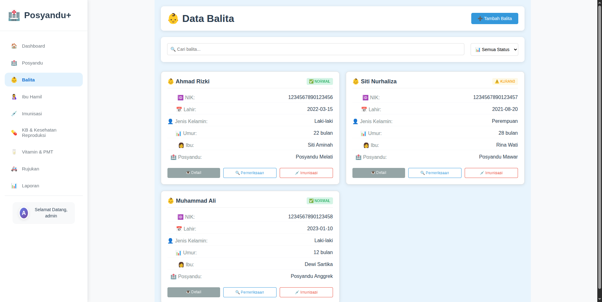
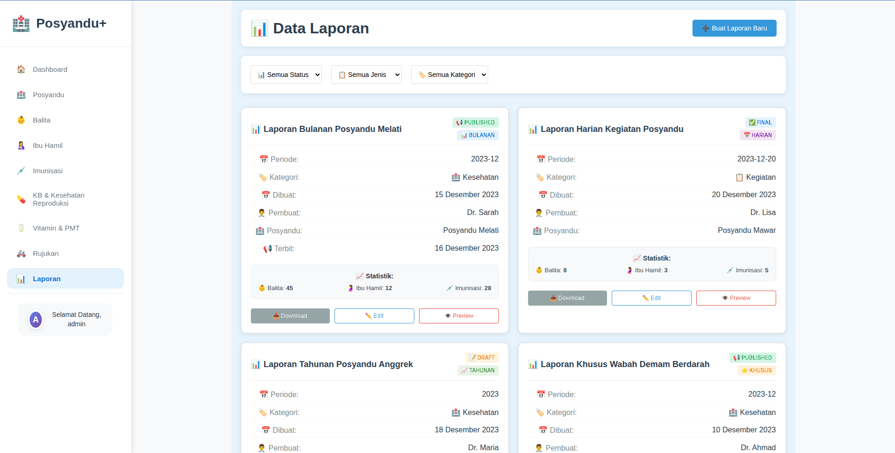

## Posyandu+ & POS BINDU PTM — Microservices Monorepo

Posyandu+ telah dipecah menjadi arsitektur microservices dan terintegrasi dengan POS BINDU PTM. Repo ini berisi semua service backend (Django), frontend (React), API Gateway (Nginx), serta skrip otomatisasi untuk development, testing, dan operasi harian.

### Screenshot Aplikasi


*Dashboard utama Posyandu+*


*Halaman login Posyandu+*


*Halaman login POS BINDU PTM*


*Modul manajemen data balita*


*Modul manajemen data ibu hamil*


*Modul pencatatan imunisasi*


*Modul keluarga berencana*


*Modul pemberian vitamin*


*Modul sistem rujukan*


*Modul laporan dan statistik*

### Isi Utama
- Arsitektur microservices untuk Posyandu+ dan POS BINDU PTM
- Orkestrasi kontainer via Docker Compose
- Frontend React terpisah per domain
- Skrip manajemen untuk start/stop/test/log semua service

## Prasyarat
- Docker
- Docker Compose
- Bash shell (Linux/Mac) atau WSL (Windows)

## Quick Start (1 Perintah)
Jalankan semua layanan dari root repository:

```bash
./start_all.sh
```

Perintah di atas akan: menghentikan port yang bentrok, stop container yang ada, build image, start semua service, menjalankan migrasi, collectstatic, dan menjalankan test dasar.

### Akses Aplikasi
- Posyandu+ Frontend: http://localhost:3000
- Posyandu+ API (via API Gateway): http://localhost
- POS BINDU PTM Frontend: http://localhost:3001
- POS BINDU PTM API (Gateway): http://localhost:8080

### Kredensial Demo
- Username: admin
- Password: admin123

## Menjalankan Secara Manual (Opsional)
Jika ingin menjalankan manual dengan Docker Compose:

```bash
docker compose up -d --build
```

Salin variabel lingkungan jika diperlukan:

```bash
cp env.example .env
```

Catatan: Sebagian besar service sudah dikonfigurasi melalui `docker-compose.yml`. File `.env` dapat dipakai untuk override/otomasi tertentu.

## Arsitektur & Layanan
Semua layanan Posyandu+ berjalan pada jaringan Docker yang sama dan memakai database PostgreSQL bersama dengan skema terpisah per service.

Layanan utama (ringkas):
- shared-database (PostgreSQL) — port 5432
- auth-service — port 8001
- posyandu-service — port 8002
- balita-service — port 8003
- ibu-hamil-service — port 8004
- imunisasi-service — port 8005
- kb-service — port 8006
- vitamin-service — port 8007
- rujukan-service — port 8008
- laporan-service — port 8009
- api-gateway (Nginx) — port 80
- frontend (React) — port 3000

Integrasi POS BINDU PTM tersedia di folder `posbindu/` (service, gateway, dan frontend-nya).

## Struktur Monorepo (ringkas)
```text
posyandu/
├─ posyandu/                  # Microservices Posyandu+
│  ├─ auth-service/
│  ├─ posyandu-service/
│  ├─ balita-service/
│  ├─ ibu-hamil-service/
│  ├─ imunisasi-service/
│  ├─ kb-service/
│  ├─ vitamin-service/
│  ├─ rujukan-service/
│  ├─ laporan-service/
│  ├─ api-gateway/
│  └─ posyandu-frontend/
├─ posbindu/                  # Microservices POS BINDU PTM
│  ├─ participant-service/ ...
│  ├─ api-gateway/
│  └─ posbindu-frontend/
├─ scripts/                   # Skrip manajemen (start/stop/test/log)
├─ docker-compose.yml         # Orkestrasi semua layanan
├─ env.example                # Contoh variabel lingkungan
└─ docs/                      # Dokumentasi lengkap
```

## Skrip Penting
Tersedia skrip untuk mempercepat pekerjaan harian:

| Perintah | Fungsi |
|---|---|
| `./start_all.sh` | Start semua layanan |
| `./stop_all.sh` | Stop semua layanan |
| `./restart_all.sh` | Restart semua layanan |
| `./status_all.sh` | Cek status layanan |
| `./test_all.sh` | Jalankan pengujian dasar |
| `./logs_all.sh` | Lihat log gabungan |
| `./cleanup_all.sh` | Bersihkan resource Docker |
| `./manage.sh` | Mode interaktif multi-perintah |

Lihat detail di `scripts/README.md`.

## Workflow Development
Contoh menjalankan migrasi pada salah satu service:

```bash
docker compose exec posyandu-service bash -lc "python manage.py makemigrations && python manage.py migrate"
```

Mengakses shell dalam service:

```bash
docker compose exec auth-service bash
```

## Troubleshooting Singkat
```bash
# Cek status semua
./status_all.sh

# Lihat log
./logs_all.sh

# Reset ringan
./restart_all.sh

# Reset penuh
./stop_all.sh && ./cleanup_all.sh && ./start_all.sh
```

## Dokumentasi Lanjutan
- Dokumentasi utama: `docs/README.md`
- Quick Start ringkas: `docs/QUICK_START.md`
- Manajemen skrip: `docs/SCRIPT_MANAGEMENT.md` dan `scripts/README.md`
- API dan dok. lengkap: `docs/API_DOCUMENTATION.md`, `docs/FINAL_COMPLETE_DOCUMENTATION.md`

## Lisensi
MIT License. Lihat bagian lisensi pada dokumentasi di `docs/`.

## Kontribusi
Kami menerima kontribusi. Baca panduan di `CONTRIBUTING.md` sebelum membuka PR.


